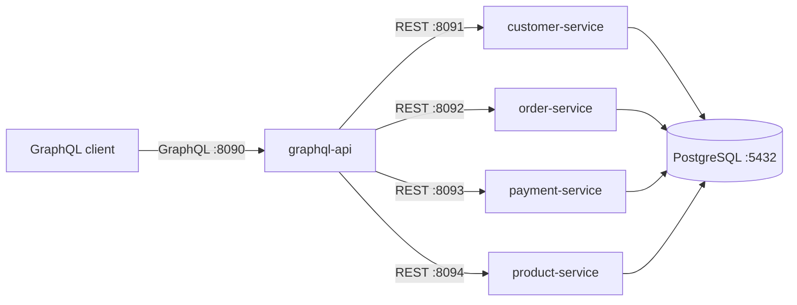

# GraphQL Microservices API

A proof-of-concept e-commerce backend that uses GraphQL as an aggregation layer over four Spring Boot REST services. A single GraphQL query can retrieve a customer together with orders, payments, order items, and products.

## Architecture



The services share one PostgreSQL database for this proof of concept, but each domain owns a separate schema:

- `customer`
- `order`
- `payment`
- `product`

The GraphQL API resolves relationships only when they are requested:

```text
Customer
└── orders
    ├── payment
    └── items
        └── product
```

## Technology stack

- Java 25
- Spring Boot 4.1.1
- Spring for GraphQL
- Spring Web MVC and `RestTemplate`
- Spring Data JPA
- PostgreSQL
- Gradle Kotlin DSL
- Docker Compose

## Applications and ports

| Application | Port | Purpose |
|---|---:|---|
| `graphql-api` | 8090 | GraphQL aggregation layer and GraphiQL UI |
| `customer-service` | 8091 | Customer data |
| `order-service` | 8092 | Orders and order items |
| `payment-service` | 8093 | Payments |
| `product-service` | 8094 | Product catalog |
| PostgreSQL | 5432 | Shared database with domain schemas |
| pgAdmin | 8080 | Database administration UI |

## Prerequisites

- JDK 25
- Docker with Docker Compose

Each application includes its own Gradle wrapper, so a system-wide Gradle installation is not required.

## Running locally

### 1. Start the database

From the repository root:

```bash
docker compose up -d
```

PostgreSQL is initialized from [`db/init.sql`](db/init.sql), which creates the schemas, tables, indexes, and sample data.

Database credentials:

```text
Database: graphql_api_poc
Username: postgres
Password: postgres
```

pgAdmin is available at <http://localhost:8080>:

```text
Email: admin@admin.com
Password: admin
```

### 2. Start the REST services

Run each command in a separate terminal from the repository root:

```bash
cd customer-service
bash gradlew bootRun
```

```bash
cd order-service
bash gradlew bootRun
```

```bash
cd payment-service
bash gradlew bootRun
```

```bash
cd product-service
bash gradlew bootRun
```

### 3. Start the GraphQL API

```bash
cd graphql-api
bash gradlew bootRun
```

Open GraphiQL at <http://localhost:8090/graphiql>.

The GraphQL HTTP endpoint is <http://localhost:8090/graphql>.

## GraphQL usage

### Retrieve a complete customer view

```graphql
query FindCustomerDetails($customerId: ID!) {
  findCustomerById(id: $customerId) {
    id
    name
    email
    createdAt
    updatedAt
    orders {
      id
      customerId
      status
      total
      createdAt
      updatedAt
      payment {
        id
        amount
        status
        paidAt
        createdAt
        updatedAt
      }
      items {
        id
        quantity
        unitPrice
        createdAt
        product {
          id
          name
          description
          price
          imageUrl
          stock
          createdAt
          updatedAt
        }
      }
    }
  }
}
```

GraphiQL variables:

```json
{
  "customerId": "replace-with-a-customer-uuid"
}
```

Because the seed script generates UUIDs, a customer ID can be obtained with:

```sql
SELECT id, name, email FROM customer.customers;
```

### Retrieve individual resources

```graphql
query FindOrder($id: ID!) {
  findOrderById(id: $id) {
    id
    status
    total
  }
}
```

```graphql
query FindProduct($id: ID!) {
  findProductById(id: $id) {
    id
    name
    price
    stock
  }
}
```

```graphql
query FindPayment($id: ID!) {
  findPaymentById(id: $id) {
    id
    amount
    status
    paidAt
  }
}
```

## REST endpoints

The GraphQL API consumes the following internal REST endpoints.

### Customer service

| Method | Endpoint | Description |
|---|---|---|
| `GET` | `/api/v1/customer` | List customers |
| `GET` | `/api/v1/customer/{id}` | Find a customer by ID |

### Order service

| Method | Endpoint | Description |
|---|---|---|
| `GET` | `/api/v1/order` | List orders |
| `GET` | `/api/v1/order/{id}` | Find an order by ID |
| `GET` | `/api/v1/order/customer/{customerId}` | Find orders belonging to a customer |

### Payment service

| Method | Endpoint | Description |
|---|---|---|
| `GET` | `/api/v1/payment` | List payments |
| `GET` | `/api/v1/payment/{id}` | Find a payment by ID |
| `GET` | `/api/v1/payment/order/{orderId}` | Find the payment belonging to an order |

### Product service

| Method | Endpoint | Description |
|---|---|---|
| `GET` | `/api/v1/product` | List products |
| `GET` | `/api/v1/product/{id}` | Find a product by ID |

## How relationship resolution works

Spring GraphQL `@SchemaMapping` methods connect fields that are not stored directly in the local GraphQL records:

- `Customer.orders` uses the customer ID to call the order service.
- `Order.payment` uses the order ID to call the payment service.
- `OrderItem.product` uses the product ID to call the product service.

Resolvers run only when their fields are selected in a GraphQL query. This keeps simple queries small, but a query containing many orders and items can produce multiple downstream REST calls. A production version should consider `@BatchMapping` or DataLoader-based batching to mitigate the N+1 problem.

## Logging

The GraphQL API logs:

- GraphQL resolver entry and completion
- Downstream HTTP method and URL
- Response status and result presence/count
- Request duration
- Downstream failures with stack traces

Application logs are enabled at `DEBUG` level for `com.lughtech.graphqlapi` in the GraphQL API configuration.

## Project structure

```text
.
├── customer-service/
├── order-service/
├── payment-service/
├── product-service/
├── graphql-api/
├── db/
│   └── init.sql
└── docker-compose.yaml
```

## Notes

- Service URLs and ports are currently configured for local development.
- The project is read-oriented and currently exposes `GET` operations.
- UUIDs are represented as GraphQL `ID` values and are passed as quoted strings.
- Date-time values use ISO-8601 representations backed by Java `OffsetDateTime`.
